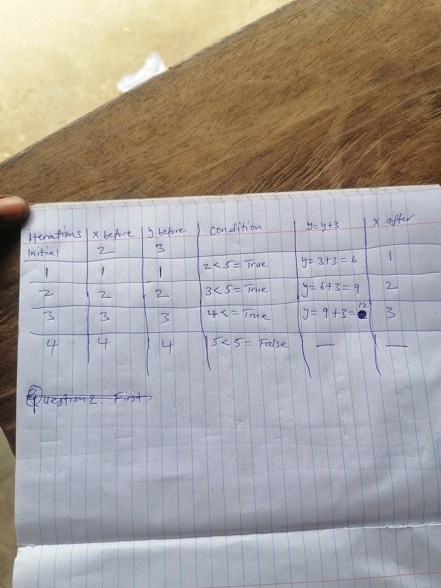

# 🔄 Concept Study: The Accumulator Pattern
**Technical Focus:** Variable State Management & Iterative Logic

### 💡 The Concept
An accumulator is a variable used to "collect" or "accumulate" data over time within a loop. This is the foundation of sums, products, and complex data processing.

### 🔬 Mathematical Execution Trace
Before writing the code, I manually verified the state changes:
- **Loop Rule:** `y = y + 3`
- **Initial State:** `y = 0`
- **Iteration 1:** `0 + 3 = 3`
- **Iteration 2:** `3 + 3 = 6`
- **Iteration 3:** `6 + 3 = 9`

### 📝 Proof of Work (Handwritten Logic)
I use Mechanical Execution Tracing on paper to master the underlying algorithm before implementation.

